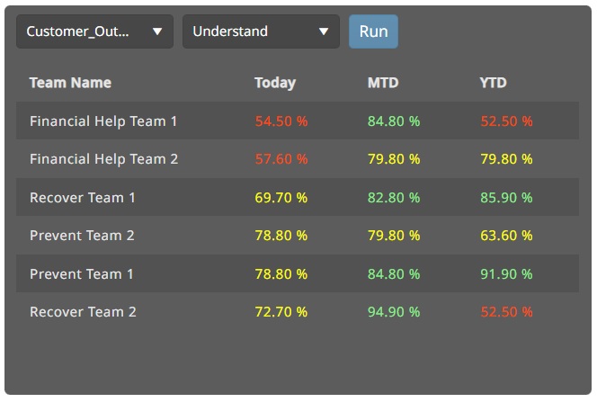

# TestTask

This project is a table in which you can change the parameters and get information depending on these parameters.



## Tech Stack

- Angular
- Kendo UI
- RxJs
- NgRx


## Installation project on your PC

1. Fork this repository and create a clone using `git clone` command (or you can download archive and  extract project from it)
2. Open terminal in the project's folder
3. Type `npm install` and wait a few minutes while the package installation complete


## Running project

1. Open terminal in the project's folder
2. Type `npm run start` and wait for the compilation complete
3. Open your browser in unsafe mode (how to run browser in unsafe mod read lower) and type `localhost:4200` in the URL line
4. (Optional) If app want you to authorize then:
```
login: testuser1
password: Angular11
```


## How to open browser in unsafe mode
- On Windows:<br/>
    1. Click Win + R
    2. Write: `your_browser.exe --user-data-dir="C:/Your_browser dev session" --disable-web-security`
    3. Example: `chrome.exe --user-data-dir="C:/Chrome dev session" --disable-web-security`
<br/><br/>
- On Linux:
    1. Open terminal
    2. Write:
```
google-chrome --disable-web-security
```
- On MacOS: 
    1. Open terminal
    2. Write:
```
open -a "Google Chrome" --args --disable-web-security --user-data-dir=/tmp/chrome
```

